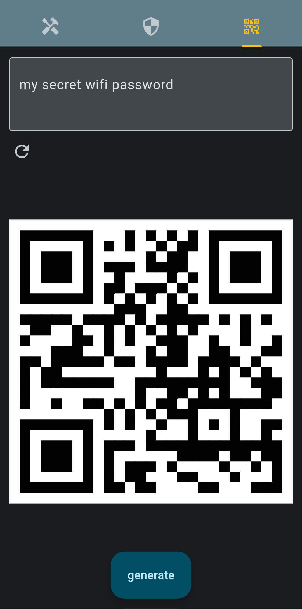

# 

## CSCI-410 project, part 1

this is part 1 of the project for the CSCI-410 course

the project demonstrates the use of flutter and dart to build production-ready mobile applications

this app is called "miscutils", short for miscellaneous utilities (how creative).

## what is miscutils?

miscutils is a set of simple components that provide some functions for development

it consists of a tabbed view, with 3 tabs that provide the following functionality:

### convert

- two-way conversion tools to/from text and the following:
  - base64
  - hex
  - binary
### hash

- one-way hashing using the following algorithms:
  - md5
  - sha256
  - bcrypt
### qrcode

- qr code generation from a string of text

## external dependencies
- convert (^3.1.1): provides some conversions not available in the standard dart convert library
- crypto (^3.0.0): provides the hashing algorithms
- bcrypt (^1.1.3): for hashing with bcrypt
- qr_flutter (^4.1.0): for qr-code generation

# 

*this app is unlikely to be maintained/developed further, since it's only meant to serve as a demo.